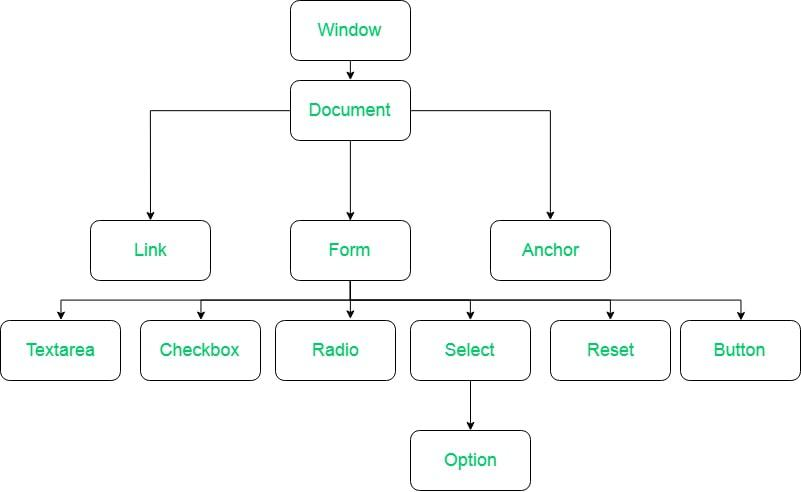
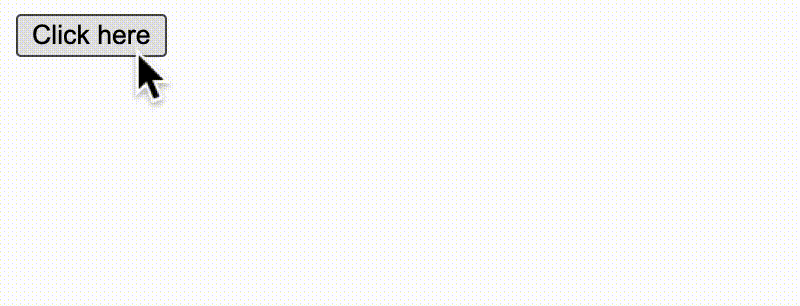
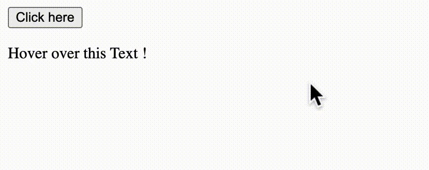
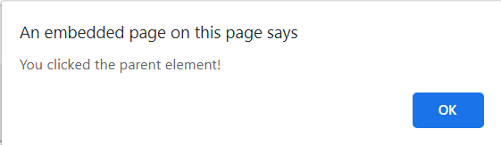
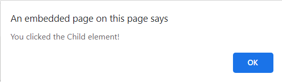
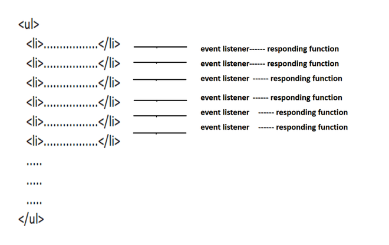
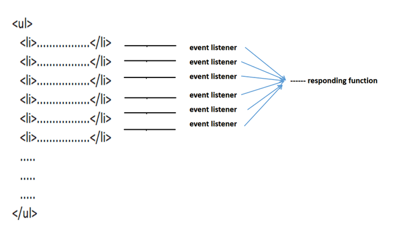
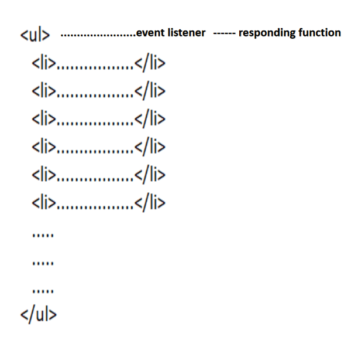
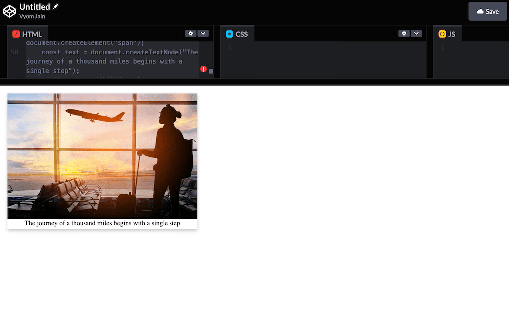
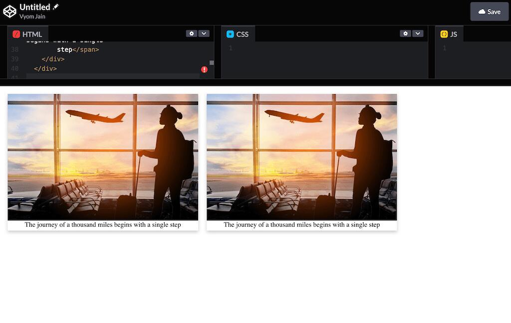

# What is DOM?

The Document Object Model (DOM) is a programming interface for HTML(Hypertext Markup Language) and XML(Extensible markup language) documents. It defines the logical structure of documents and the way a document is accessed and manipulated.

*Note: It is called a Logical structure because DOM doesn’t specify any relationship between objects.*

DOM is a way to represent the webpage in a structured hierarchical way so that it will become easier for programmers and users to glide through the document. With DOM, we can easily access and manipulate tags, IDs, classes, Attributes, or Elements of HTML using commands or methods provided by the Document object. Using DOM, the JavaScript gets access to HTML as well as CSS of the web page and can also add behavior to the HTML elements. So basically Document Object Model is an API that represents and interacts with HTML or XML documents.

## Why DOM is required?

HTML is used to structure the web pages and JavaScript is used to add behavior to our web pages. When an HTML file is loaded into the browser, the JavaScript can not understand the HTML document directly. So, a corresponding document is created(DOM). DOM is basically the representation of the same HTML document but in a different format with the use of objects. JavaScript interprets DOM easily i.e. JavaScript can not understand the tags(<h1>H</h1>) in HTML document but can understand object h1 in DOM. Now, JavaScript can access each of the objects (h1, p, etc) by using different functions.

Structure of DOM: DOM can be thought of as a Tree or Forest(more than one tree). The term structure model is sometimes used to describe the tree-like representation of a document.  Each branch of the tree ends in a node, and each node contains objects  Event listeners can be added to nodes and triggered on an occurrence of a given event. One important property of DOM structure models is structural isomorphism: if any two DOM implementations are used to create a representation of the same document, they will create the same structure model, with precisely the same objects and relationships.

Why called an Object Model?
Documents are modeled using objects, and the model includes not only the structure of a document but also the behavior of a document and the objects of which it is composed like tag elements with attributes in HTML.

**Properties of DOM:** Let’s see the properties of the document object that can be accessed and modified by the document object.



## Properties of DOM

- Window Object: Window Object is object of the browser which is always at top of the hierarchy.  It is like an API that is used to set and access all the properties and methods of the browser. It is automatically created by the browser.
- Document object: When an HTML document is loaded into a window, it becomes a document object. The ‘document’ object has various properties that refer to other objects which allow access to and modification of the content of the web page. If there is a need to access any element in an HTML page, we always start with accessing the ‘document’ object. Document object is property of window object.
- Form Object: It is represented by form tags.
- Link Object: It is represented by link tags.
- Anchor Object: It is represented by a href tags.
- Form Control Elements: Form can have many control elements such as text fields, buttons, radio buttons, checkboxes, etc.


======================================================================================================================


# Searching the DOM

HTML DOM getElementByID() Method 

The getElementById() method returns the elements that have given an ID which is passed to the function. This function is a widely used HTML DOM method in web designing to change the value of any particular element or get a particular element. If the passed ID to the function does not exist then it returns null. The element is required to have a unique id, in order to get access to that specific element quickly, & also that particular id should only be used once in the entire document.

Syntax:
```
document.getElementById( element_ID )
```

- Parameter: This function accepts single parameter element_ID which is used to hold the ID of the element.
- Return Value: It returns the object of the given ID. If no element exists with the given ID then it returns null.

Example 1: This example describes the getElementById() method where element_id is used to change the color of the text on clicking the button.

```html
<!DOCTYPE html>
<html>
  
<head>
    <title>
        DOM getElementById() Method
    </title>
  
    <script>
  
        // Function to change the color of element
        function geeks() {
            var demo = document.getElementById("geeks");
            demo.style.color = "green";
        }
    </script>
</head>
  
<body style="text-align:center">
    <h1 id="geeks">GeeksforGeeks</h1>
    <h2>DOM getElementById() Method</h2>
  
    <!-- Click on the button to change color -->
    <input type="button" 
           onclick="geeks()" 
           value="Click here to change color" />
</body>
  
</html>
```

Example 2: This example describes the getElementById() method where the element_id is used to change the content on clicking the button.

```html
<!DOCTYPE html>
<html>
  
<head>
    <title>
        DOM getElementById() Method
    </title>
  
    <script>
        // Function to change content of element
        function geeks() {
            var demo = document.getElementById("geeks");
            demo.innerHTML = "Welcome to GeeksforGeeks!";
        }
    </script>
</head>
  
<body style="text-align:center">
    <h1>GeeksforGeeks</h1>
    <h2>DOM getElementById() Method</h2>
    <h3 id="geeks">Hello Geeks!</h3>
  
    <!-- Click here to change content -->
    <input type="button" 
           onclick="geeks()" 
           value="Click here to change content" />

</body>
  
</html>
```

2. DOM querySelectorAll() Method

The querySelectorAll() method in HTML is used to return a collection of an element’s child elements that match a specified CSS selector(s), as a static NodeList object. The NodeList object represents a collection of nodes. The nodes can be accessed by index numbers. The index starts at 0. 

Note: If we want to apply CSS property to all the child nodes that match the specified selector, then we can just iterate through all nodes and apply that particular property.

Syntax:
```
element.querySelectorAll(selectors)
```

Selectors is the required field. It specifies one or more CSS selectors to match the element.These selectors are used to select HTML elements based on their id, classes, types, etc. 

In case of multiple selectors, comma is used to separate each selector.

Example: 

```html
<!DOCTYPE html>
<html>
    <head>
        <title>DOM querySelectorAll() Method</title>
        <style>
            #geek {
              border: 1px solid black;
              margin: 5px;
            }
        </style>
    </head>

    <body style = "text-align: center;">
        <h1 style = "color: green;">GeeksforGeeks</h1>
        <h2>querySelectorAll() Method</h2>

        <div id="geek">        
            <p>This is paragraph 1.</p>
            <p>This is paragraph 2.</p>
        </div>

        <button onclick="myFunction()">Try it</button>

        <script>
            function myFunction() {
                var x = document.getElementById("geek").querySelectorAll("p");
                var i;
                for (i = 0; i < x.length; i++) {
                x[i].style.backgroundColor = "green";
                x[i].style.color = "white";
                }
            }
        </script>
    </body>
</html>
```

======================================================================================================================

# Event Listener

An event is an important part of JavaScript.A web page respond according to an event occurred. Some events are user generated and some are generated by API’s. An event listener is a procedure in JavaScript that waits for an event to occur. The simple example of an event is a user clicking the mouse or pressing a key on the keyboard.

The **addEventListener()** is an inbuilt function in JavaScript which takes the event to listen for, and a second argument to be called whenever the described event gets fired. Any number of event handlers can be added to a single element without overwriting existing event handlers. 

Syntax:  
```
element.addEventListener(event, listener, useCapture);
```

Parameters: 

- event : event can be any valid JavaScript event.Events are used without “on” prefix like use “click” instead of “onclick” or “mousedown” instead of “onmousedown”.
- listener(handler function) : It can be a JavaScript function which respond to the event occur.
- useCapture: It is an optional parameter used to control event propagation. A boolean value is passed where “true” denotes capturing phase and “false” denotes the bubbling phase.

JavaScript Code to show the working of addEventListener() method: 

code #1: 

```html
<!DOCTYPE html>
<html lang="en">
    <head>
        <meta charset="UTF-8">
        <meta name="viewport" content="width=device-width, initial-scale=1.0">
        <title>Event Listener Example</title>
    </head>
    <body>

    <button id="myButton">Click me</button>
    <p id="geek"></p>

    <script>
        // Get the button element by its ID
        var button = document.getElementById("myButton");
        var geek=document.getElementById("geek")

        // Define the event handler function
        function handleClick() {
        //   alert("Button clicked!");
        geek.innerHTML='<H1>GeeksforGeeks</H1>'
        }

        // Attach the event listener to the button
        button.addEventListener("click", handleClick);

    </script>

    </body>
</html>
```

 

Output:
```


Text appears when button is clicked
``` 

code #2:

In this example two events “mouseover” and “mouseout” are added to the same element. If the text is hovered over then “mouseover” event occur and RespondMouseOver function invoked, similarly for “mouseout” event RespondMouseOut function invoked. 

```html
<!DOCTYPE html>
<html>
  
<body>
    <button id="clickIt">Click here</button>
  
    <p id="hoverPara">Hover over this Text !</p>
  
  
    <b id="effect"></b>
  
    <script>
        const x = document.getElementById("clickIt");
        const y = document.getElementById("hoverPara");
  
        x.addEventListener("click", RespondClick);
        y.addEventListener("mouseover", RespondMouseOver);
        y.addEventListener("mouseout", RespondMouseOut);
  
        function RespondMouseOver() {
            document.getElementById("effect").innerHTML +=
                       "MouseOver Event" + "<br>";
        }
  
        function RespondMouseOut() {
            document.getElementById("effect").innerHTML +=
                      "MouseOut Event" + "<br>";
        }
  
        function RespondClick() {
            document.getElementById("effect").innerHTML +=
                      "Click Event" + "<br>";
        }
    </script>
</body>
  
</html>
```

Output:
```


Events logged on different interactions
```

======================================================================================================================


# Event Bubbling

Event bubbling is a method of event propagation in the HTML DOM API when an event is in an element inside another element, and both elements have registered a handle to that event. It is a process that starts with the element that triggered the event and then bubbles up to the containing elements in the hierarchy. In event bubbling, the event is first captured and handled by the innermost element and then propagated to outer elements.

Syntax: 
```
addEventListener(type, listener, useCapture)
```

- type: Use to refer to the type of event.
- listener: Function we want to call when the event of the specified type occurs.
- userCapture: Boolean value. Boolean value indicates event phase. By Default useCapture is false. It means it is in the bubbling phase.

Example 1: This example shows the working of event bubbling in JavaScript.

```html
<!DOCTYPE html>
<html>
 
<head>
    <title>
        Bubbling Event in Javascript
    </title>
</head>
 
<body>
 
    <h2>Bubbling Event in Javascript</h2>
 
    <div id="parent">
      <button>
          <h2>Parent</h2>
      </button>
      <button id="child">
           
<p>Child</p>
 
      </button>
    </div><br>
 
 
    <script>
        document.getElementById(
"child").addEventListener("click", function () {
            alert("You clicked the Child element!");
        }, false);
 
        document.getElementById(
"parent").addEventListener("click", function () {
            alert("You clicked the parent element!");
        }, false);
    </script>
 
</body>
 
</html>
```

**Output:**

 
After clicking on the Parent button:


 
After clicking on the Child button:



 

From above example we understand that in bubbling the innermost element’s event is handled first and then the outer: the <p> element’s click event is handled first, then the `<div>` element’s click event.

===================================================================================================================


# Event Delegation

Event Delegation is basically a pattern to handle events efficiently. Instead of adding an event listener to each and every similar element, we can add an event listener to a parent element and call an event on a particular target using the .target property of the event object.

Let’s see an example with and without event delegation

```js
const customUI = document.createElement('ul');

for (var i = 1; i <= 10; i++) {
    const newElement = document.createElement('li');
    newElement.textContent = "This is line " + i;
    newElement.addEventListener('click', () => {
        console.log('Responding')
    })
    customUI.appendChild(newElement);
}
```

The above code will associate the function with every `<li>` element that is shown in the below image. We are creating an <ul> element, attaching too many `<li>` elements, and attaching an event listener with a responding function to each paragraph as we create it.



 
Implementing the same functionalities with an alternate approach. In this approach, we will associate the same function with all event listeners. We are creating too many responding functions (that all actually do the exact same thing). We could extract this function and just reference the function instead of creating too many functions:

```js
const customUI = document.createElement('ul');

function responding() {
    console.log('Responding')
}

for (var i = 1; i <= 10; i++) {
    const newElement = document.createElement('li');
    newElement.textContent = "This is line " + i;
    newElement.addEventListener('click', responding)
    customUI.appendChild(newElement);
}
```

The functionality of the above code is shown below –



 
In the above approach, we still have too many event listeners pointing to the same function. Now implementing the same functionalities using a single function and single event.

```js
const customUI = document.createElement('ul');

function responding() {
    console.log('Responding')
}

for (var i = 1; i <= 10; i++) {
    const newElement = document.createElement('li');
    newElement.textContent = "This is line " + i;
    customUI.appendChild(newElement);
}
customUI.addEventListener('click', responding)
```



Now there is a single event listener and a single responding function. In the above-shown method, we have improved the performance, but we have lost access to individual `<li>` elements so to resolve this issue, we will use a technique called event delegation. 


The event object has a special property call .target which will help us in getting access to individual `<li>` elements with the help of phases.

Steps:

- `<ul>` element is clicked.
- The event goes in the capturing phase.
- It reaches the target (`<li>` in our case).
- It switches to the bubbling phase.
- When it hits the `<ul>` element, it runs the event listener.
- Inside the listener function event.target is the element that was clicked.
- Event.target provides us access to the `<li>` element that was clicked.


The .nodeName property of the .target allows us to identify a specific node. If our parent element contains more than one child element then we can identify specific elements by using the .nodeName property.


```js
const customUI = document.createElement('ul');

function responding(evt) {
    if (evt.target.nodeName === 'li')
        console.log('Responding')
}

for (var i = 1; i <= 10; i++) {
    const newElement = document.createElement('li');
    newElement.textContent = "This is line " + i;
    customUI.appendChild(newElement);
}

customUI.addEventListener('click', responding);
```

===================================================================================================================

# Creating HTML with Javascript

In this article, we will discuss how to create HTML elements using JavaScript.

The following HTML has been provided to us, and our task is to recreate the given card element using JavaScript.

```html
<!DOCTYPE html>
<html>

<head>
  <meta charset="UTF-8" />
  <meta http-equiv="X-UA-Compatible" content="IE=edge" />
  <title>Creating HTML Element with JS</title>
  <style>
    #parent-container {
      display: flex;
      flex-direction: row;
    }

    .card-container {
      width: 30%;
      display: flex;
      flex-direction: column;
      text-align: center;
      box-shadow: 0 4px 8px 0 rgba(0, 0, 0, 0.2);
      margin: 10px;
      padding-bottom: 5px;
    }

    @media only screen and (max-width: 600px) {
      #parent-container {
        flex-direction: column;
      }
    }
  </style>
</head>

<body>
  <div id="parent-container">
    <div class="card-container">
      
      <span>The journey of a thousand miles begins with a single
        step</span>
    </div>
  </div>

  <script src="index3.js"></script>
</body>

</html>
```

**Output:**
Rendered HTML




To re-create the card, we would first fetch the parent-container, by using document.getElementById(), then we would use the document.createElement method to create a new element and set the CSS classes for that element using the .classlist.add() method.

Then, we would create another element - the image element with correct alt text(using setAttribute) and the span with the text, and finally add child elements to parent elements using the .appendChild() method.

Check out the JS code enclosed in the script tag below -

```html
<!DOCTYPE html>
<html>

<head>
  <meta charset="UTF-8" />
  <meta http-equiv="X-UA-Compatible" content="IE=edge" />
  <title>Creating HTML Element with JS</title>

  <style>
    #parent-container {
      display: flex;
      flex-direction: row;
    }

    .card-container {
      width: 30%;
      display: flex;
      flex-direction: column;
      text-align: center;
      box-shadow: 0 4px 8px 0 rgba(0, 0, 0, 0.2);
      margin: 10px;
      padding-bottom: 5px;
    }

    @media only screen and (max-width: 600px) {
      #parent-container {
        flex-direction: column;
      }
    }
  </style>
</head>

<body>
  <div id="parent-container">
    <div class="card-container">
      
      <span>The journey of a thousand miles begins with a single
        step</span>
    </div>
  </div>

  <script type="text/javascript">
    const parentContainer = document.getElementById("parent-container");
    
    const cardContainer = document.createElement("div");
    cardContainer.classList.add("card-container");
    
    const cardImage = document.createElement("img");
    cardImage.setAttribute("src", "https://wttc.org/DesktopModules/MVC/NewsArticleList/images/141_20201013185512_Consumer%20Survey%20Finds%2070%20Percent%20of%20Travelers%20plan%20to%20Holiday%20in%202021.jpg");
    cardImage.setAttribute('alt', "travel-card");
    
    const cardSpan = document.createElement("span");
    const text = document.createTextNode("The journey of a thousand miles begins with a single step");
    cardSpan.appendChild(text);
    
    cardContainer.appendChild(cardImage);
    cardContainer.appendChild(cardSpan);
    
    parentContainer.appendChild(cardContainer);
  </script>
</body>

</html>
```

**Output:**



New element made with JS identical to the one made with HTML
