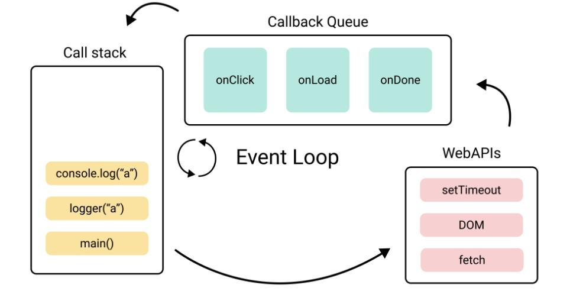
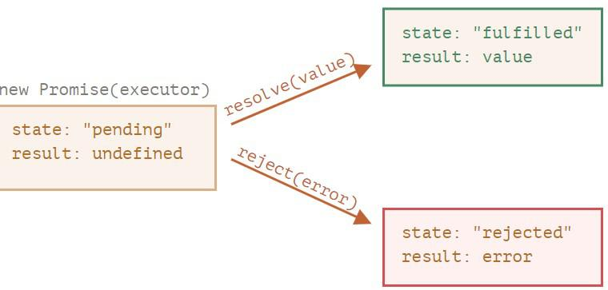

# Callback functions

A callback function is a function that is passed as an argument to another function and is invoked or called by that function at a certain point in time. The main purpose of a callback function is to allow asynchronous processing or non-blocking behavior in programming languages that support it. Callback functions are commonly used in event handling, such as when responding to user actions or when performing operations that require significant time to complete. They are also used in higher-order functions that take other functions as arguments, such as map(), filter(), and reduce() function in JavaScript.

let us try to understand with the help of the example 

```js
function outer(wrapper){
 console.log("Outer function is called");
 wrapper();
}
function callback(){
  console.log("function b is called");
}
outer(callback);
```

**Output:**
```
Outer function is called
function b is called
```

It is important to remember that the execution of the callback function depends upon the execution of the function, which the callback is passed to.

Let us understand how callback functions are useful for async Programming.

Take an example of setTimeout method  - It is a method used to execute a piece of code after a certain delay.
 

```js
console.log("hello");
setTimeout(function callback(){
  console.log("Delayed by 4 seconds ");

},4000)
```

**Output:**
```
hello
Delayed by 4 seconds 
```

Here the callback function passed to setTimeout executes after a delay of 4 seconds hence it is useful in async Programming.

Another example of a callback function could be the use case of fetch.

```js
fetch('https://jsonplaceholder.typicode.com/posts/1')
  .then(response => response.json())
  .catch(error => console.error(error));
```

Here we are making a network call to fetch some data from the JSON placeholder and we are waiting for the response to come back, once we receive the response our callback function is executed which is passed as an argument to the then method. In case Our response fails, our callback function for the catch method is called.

Without the concepts of Callback Functions ,async Programming could not be possible.

------------------------------------------------------------------------------------

# How async Js Works ?

`JavaScript is a Single-threaded Synchronous language` by single Threaded means that the js engine has a single thread to execute instructions. By synchronous, it means that the js engine executes code line by line (one line at a time).

## What is Async Programming?
Async programming is a programming model that allows code to run asynchronously or non-blocking. This means that while a task is being executed, other code can continue to run concurrently without waiting for the task to complete.

*So how does async behavior is achieved by JavaScript?*

*It is important to understand that the js engine only has a single call stack to execute js code but it still manages to make async programming work like `fetching data from a server`, `calling set timeout`, `providing timer`, `local Storage`, etc. So `How do JS engines execute all that?`*

The ability of js to execute async tasks like calling an API, doing console.log, and manipulating dom events is not part of the js engine but it is provided by the browser where the js engine executes javascript code. Let's look at the image below to understand what all functionalities the browser provides to the js Engine.

 


 
The timer is provided by the browser which allows the power to execute methods like setTimeout and setInterval that allow certain delays in the set timeout call.

All the dom-related methods to access and attach event listeners on certain nodes are also provided by Browser to the js engine.
Even the most famous console is not part of the js engine but is part of web-api provided by the browser.

Let us now try to understand how async code gets executed.

*Example:*

```js
console.log("Line1");
setTimeout(function callback1(){
  console.log("Line3");
  
},3000);
console.log("Line6");
```


**Output:**
```
Line1
Line2
Line3
```

To understand how this code works out we need to understand the event loop and callback queue 

- **Event Loop**  
In JavaScript, an event loop is a mechanism that enables asynchronous programming. The event loop works by continuously processing a queue of events and executing any associated callbacks or functions.

- **Callback Queue**
In JavaScript, the callback queue is a mechanism used by the event loop to manage asynchronous code execution. Whenever an asynchronous operation is performed, such as a timer set by setTimeout() or an HTTP request made by fetch(), the associated callback function is added to the callback queue.

The event loop constantly monitors the callback queue and executes the callbacks in the order in which they were added, one at a time. This ensures that the JavaScript runtime remains single-threaded and that no two callbacks are executed simultaneously.

Explanation For the code example above 

first, line1  is executed and it simply prints console.log("line1") then as soon as js engines encounter setTimeout it sets a timer in the web API and the call stack gets empty then line 6 gets executed due to javascript synchronous and non-blocking nature. Once the timer is expired in the web-API it registers and passes the callback function in the callback queue also at the same time event loop is continuously monitoring the call stack whether it is empty or not, once it sees the call stack as empty it pushes the callback method in the call stack and then callback function gets executed and it prints to console.log("line6");

Example 2 

```js
console.log("lets Start");   // line1
const btnAddtoCart = document.getElementById("btn");  //line2
btnAddtoCart.addEventListener("click",()=> {     //line3
  console.log("Button Clicked");
});
console.log("Bye Bye ......");
```

Let us try to understand the execution of the code above line by line.

Initially, the line1 console.log("Let Start") is printed then js engine moves to the next line and extracts the node from the DOM and saves its reference in a variable called btnAddtoCart.

Then as soon it encounters line 3, event listener is registered in the web-API and the js engine moves forward and prints the last line console.log("Bye Bye ").

Once a user clicks on the button to which the event listener is attached, the callback is pushed into the callback queue, and once the event loop finds the call stack as empty callback queue pushes the callback function into the call stack, and the function gets executed.

So the output of the above will always be:
```
"lets Start"
"Bye Bye ....."
"Button Clicked"
```
 
Here is the image of the Event loop and callback queue
 



We have an important point to understand in case we have both the setTimeout and Promise callbacks in our code then whose Callback will be executed first?

The callback queue is the queue which is also known by the name task Queue but we also have a queue named microTask queue.
All the promised-based callbacks are registered inside the microtask queue and have the highest priority and all the other types of callback are pushed into the callback queue or the task queue as it have less priority then the microtask queue.


-------------------------------------------------------------------------------------


# Callback hell

In JavaScript, *the scenario where the code becomes densely nested and challenging to read due to the overuse of callbacks is referred to as "callback hell."*

When using asynchronous actions, like network requests or file operations, where the code must wait for a response before continuing, this can happen. It can be difficult to handle the code and to keep track of the execution flow when several callbacks are chained together and nested inside one another. For developers, this can result in bugs, mistakes, and a great deal of stress.

let us try to understand this by considering this scenario - : 

On a hotel booking website, the general flow to booking a hotel is this - :
First API is called to book a hotel then an API is called to Proceed To Payment then after that, an API is called to showBookingStatus then internally an API is called to updateBookingHistory at the server side. Now let's try to implement this in a piece of code 

```js
bookHotel(hotelId,function(){
     if(err){
         errorHandler();
      }else{
         proceedToPayment(hotelId,function(){
            if(err){
              erroHandler();
            }else{
              showBookingStatus(hotelId,function(){
                 if(err){
                   errorHandler();
                 }else{
                   updateBookingHistroy(hotelId,function(){
                     success();
                   })
                  }
              })
             }
         })
       }
})
```

Now we are calling an API called book hotel and depending upon the response we are calling another API known as proceedToPayment depending upon the result of the previous API we are calling another API.

So this creates two problems-
1 Pyramid Of Doom
2 Inversion of Control 

If you take a look at the above code it is clear that our code is expanding in the horizontal direction instead of the vertical direction which is considered a bad practice in programming as it makes the code less readable and difficult to identify bugs as well.

The second Problem with this callback style of Programming is the inversion of control, the callback function's actual control is given to the function that it is being passed as an argument into so suppose our API gets into the ideal State i.e we get no response from the server our callback function will never be executed 

In order to resolve these issues we use promises and the async-await style of async programming.


---------------------------------------------------------------------------------

# Promises in Javascript

A promise in JavaScript represents the eventual outcome of an asynchronous operation and its value, whether successful or failed. Promises are commonly used to handle various asynchronous tasks such as fetching data from an API, reading files, or waiting for a timer to expire.

Consider Promise as a special Object in Javascript which has different states and corresponding different values of each state.
A promise is initially in a pending state and changes to either a "Fulfilled" or "rejected" state depending on whether the promise was resolved or rejected. Initially, the value of the promise is undefined and changes to the value of the resolve(value) method if the promise is successful or changes to an error in case the reject(error) method is called.
Look at this diagram to understand it in a better way.

 



Now let us Understand How can we consume promises?
In case we are fetching data from an API using the fetch method which returns a promise we need to consume it to read the actual response from the server. let us look at the example of a fetch call and how can we consume a promise returned by Fetch().
 

```js
let promise1 = fetch('https://randombig.cat/roar.json');
promise1.then(function(response){
  return response.json();
}).then(function(commits){
 alert(commits[0].author.login)
}).catch(function(error){
 alert("Some Error in fetching response")
});
```

In the code above we have special methods then and catch which are used to consume promises. we attach then method to the promise and pass a callback function to then method which will be executed once the promise is successfully resolved in case the promise is rejected catch method callback function gets executed and displays the appropriate response.

It is important to remember that each call on then method also returns the promise whose fulfilled value is equal to the value returned by the callback function inside then method.


----------------------------------------------------------------------------------------


# Creating a Promise and Method Chaining

In this article, we will learn how can we create our own Promise.

We use new Promise Constructor Syntax to create a new Promise -

```js
let promise = new Promise(function(resolve, reject) {
 // executor 
});
```

The executor is the function that is provided to the new Promise. When a new Promise is created, the executor is executed automatically. The callbacks, resolve, and reject, are provided by JavaScript itself, and our code is only contained within the executor. Regardless of whether the result is obtained soon or late, the executor must call either the resolve(value) callback, indicating successful completion of the job along with the result value, or the reject(error) callback, indicating an error object if an error occurred.

let us try to understand this with the help of an example 

```js
const isRequestSuccessfull = true;

let promise = new Promise((resolve,reject)=>{
  if(isRequestSuccessfull){
   resolve("promise resolved");
  }else{
   const error = new Error("Something Went Wrong");
   reject(error.message);
  }
});

console.log(promise);
```

**Output:**
```
Promise { 'promise resolved' }
```

As in the above code, the executor function runs immediately and calls resolve inside the if condition.If the value of isRequestSuccessfull is false then it would have called reject and with the promise state as Rejected. Now let us see how can we consume our promise code using the then and catch method.

See the code below 

```js
const isRequestSuccessfull = true;

let promise = new Promise((resolve,reject)=>{
  if(isRequestSuccessfull){
   resolve("promise resolved");
  }else{
   const error = new Error("Something Went Wrong");
   reject(error.message);
  }
});

promise.then(response=>console.log(response))
.catch(err=>console.log(err));
```

**Output:**
```
promise resolved
```

It is important to remember that in case the executor calls the resolve method, the value of the response parameter in the callback of then method will always be equal to the value passed in as the argument while calling the resolve method resolve(value). So then method is used to handle successful responses generally, although it is also capable of handling the reject response as well.

Now let us see what happens in case the promise is Rejected.

```js
const isRequestSuccessfull = false;

let promise = new Promise((resolve,reject)=>{
  if(isRequestSuccessfull){
   resolve("promise resolved");
  }else{
   const error = new Error("Something Went Wrong");
   reject(error.message);
  }
});

promise.then(response=>console.log(response))
.catch(err=>console.log(err));
```

**Output:**
```
Something Went Wrong
```

Here we can see that the output is "Something Went Wrong" because the promise was rejected catch method callback was fired and the value of the err is equal to the argument passed into the reject() method inside the executor function.

Now let us see how can we handle multiple chaining using then method.

Promise Chaining: Promise Chaining is a simple concept by which we may initialize another promise inside our .then() method and accordingly we may execute our results. The function inside then captures the value returned by the previous promise

The syntax for using promise chaining is as follows.
```js
    let promise = new Promise((resolve, reject) => {
    resolve("Hello JavaScript");
    });
     
    promise
    .then( function (result1){
        console.log(result1);
        return new Promise((resolve,reject) =>{
            resolve("GFG is awesome");
        })
    })
    .then((result2) => {
        console.log(result2);
    });
```

**Output:**
```
Hello JavaScript
GFG is awesome
```

Lets see another example:

```js
function asyncOperation(value) {
  return new Promise((resolve, reject) => {
    // Simulating an asynchronous operation
    setTimeout(() => {
      const result = value * 2;
      resolve(result);
    }, 1000);
  });
}

// Chain multiple 'then' methods
asyncOperation(3)
  .then(result1 => {
    console.log(`Step 1: ${result1}`);
    return result1 + 5;
  })
  .then(result2 => {
    console.log(`Step 2: ${result2}`);
    return result2 * 3;
  })
  .then(finalResult => {
    console.log(`Final Result: ${finalResult}`);
  })
  .catch(error => {
    console.error(`Error: ${error}`);
  });
```

**Output:**

```
Step 1: 5
Step 2: 0
Final Result: 0
```

--------------------------------------------------------------------------------------


# Promise API'S - promise.all(), Promise.allSettled(), Promise.race() v/s Promise.any()

The  Promise API comprises a collection of JavaScript functionalities that facilitate the handling of asynchronous code in a more graceful and comprehensible manner. Essentially, a Promise is an object that denotes a value that might not be accessible immediately but will be resolved eventually.
We will cover Promise.all() ,Promise.allSettled(), Promise.race() v/s Promise.any() in this article .

1. Promise.all()

Consider a scenario where we have to execute multiple promises in parallel and wait until all of them are ready. For instance, download several URLs in parallel and process the content once they are all done.

The syntax is:
```js
let promise = Promise.all();
```

Let us Try to Understand this with an example.
 

```js
let promise1 = new Promise(resolve => setTimeout(() => resolve(1), 3000));
let promise2 = new Promise(resolve => setTimeout(() => resolve(2), 2000)); // 2
let promise3 = new Promise(resolve => setTimeout(() => resolve(3), 1000)); // 3

let finalPromise = Promise.all([promise1,promise2,promise3]);
finalPromise.then(res=>console.log(res)).catch(err=>console.log(err));
```

**Output:**
```
[ 1, 2, 3 ]
```
Here You can see that the result Promise gives an array consisting of resolved promises value.

Please note that the order of the resulting array members is the same as in its source promises. Even though the first promise takes the longest time to resolve, it’s still first in the array of results.
It is important to observe that the sequence of elements in the resulting array corresponds to that of the source promises. This implies that although the initial promise may take the most time to resolve, it will still be the first member in the outcome array.

let us Look at another example in which we are fetching different url of different GitHub profiles.

```js
const urls = [
  'https://api.github.com/users/prakashsakari',
  'https://api.github.com/users/AshishJangra27',
];
const requests = urls.map(url => fetch(url));
Promise.all(requests)
  .then(responses => responses.forEach(
    response => console.log(`${response.url}: ${response.status}`)
  )).catch(err => console.log(err.message));

The output of the above code will be 
https://api.github.com/users/prakashsakari: 200
https://api.github.com/users/AshishJangra27: 200

Promise.allSettled()
```

Promise.all rejects as a whole if any promise rejects. That’s good for “all or nothing” cases when we need all results successful to proceed.Promise.allSettled just waits for all promises to settle, regardless of the result.

The resulting array will be -
```
{status: "fulfilled", value: result} for successful responses 
{status: "rejected", reason: error} for errors
```

look at the code below to understand better.

```js
let urls = [
  'https://api.github.com/users/prakashsakari',
  'https://api.github.com/users/AshishJangra27',
  'https://no-such-url'
];
Promise.allSettled(urls.map(url => fetch(url)))
  .then(results => { // (*)
    results.forEach((result, num) => {
      if (result.status == "fulfilled") {
        console.log(`${urls[num]}: ${result.value.status}`);
      }
      if (result.status == "rejected") {
        console.log(`${urls[num]}: ${result.reason}`);
      }
    });
  });
```

The output of the above code will be:
``` 
[
 {status: 'fulfilled', value: ...response...},
 {status: 'fulfilled', value: ...response...},
 {status: 'rejected', reason: ...error object...}
]
```

We can see even when the third promise is rejected the overall result of the promise is not rejected  but it gives the successful response of the first two promises and only shows rejected for the promise that was rejected unlike promise.all .

2. Promise.race()

This function is like Promise.all, but instead of waiting for all promises to settle, it only waits for the first one to settle and retrieves its result or error.

```js
Promise.race([
  new Promise((resolve, reject) => setTimeout(() => resolve(1), 1000)),
  new Promise((resolve, reject) => setTimeout(() => reject(new Error("Whoops!")), 2000)),
  new Promise((resolve, reject) => setTimeout(() => resolve(3), 3000))
]).then(res => console.log(res))  // 1
```

Since the initial promise was the quickest to settle, it became the final outcome. Once the first promise is settled and emerges as the winner, any subsequent results or errors are disregarded.

3. Promise.any()

```js
Promise.any([
  new Promise((resolve, reject) => setTimeout(() => reject(new Error("Whoops!")), 1000)),
  new Promise((resolve, reject) => setTimeout(() => resolve(1), 2000)),
  new Promise((resolve, reject) => setTimeout(() => resolve(3), 3000))
]).then(res=>console.log(res)); // 1
```

Although the initial promise was the quickest, it was rejected, and as a result, the second promise became the outcome. Once the first promise that was fulfilled wins the race, any additional outcomes are disregarded.

So What is the difference between Promise. any and promise. race ?
Here's an example: imagine you have three promises that represent different tasks you want to do simultaneously. Promise 1 represents checking your email, Promise 2 represents making a phone call, and Promise 3 represents sending a text message.

If you use `Promise.race()`, the method will return the result of the first promise that finishes, whether it was successful or not. So, if Promise 1 finishes first but it's a rejection (e.g., you couldn't log in to your email), the `Promise.race()` method will immediately return the rejection value without waiting for Promise 2 or Promise 3 to finish.

If you use` Promise.any()`, the method will return the first promise that finishes successfully (i.e., it gets resolved). So, if Promise 2 finishes first and it's successful (e.g., you finished your phone call), Promise. any() will return that result and Promise 1 and Promise 3 will stop executing. However, if none of the promises get resolved and they all reject, then` Promise.any()` will throw an error.

