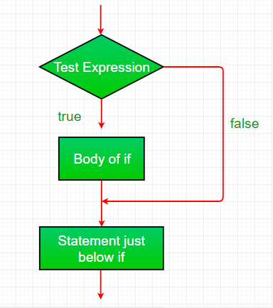
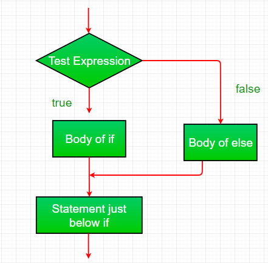
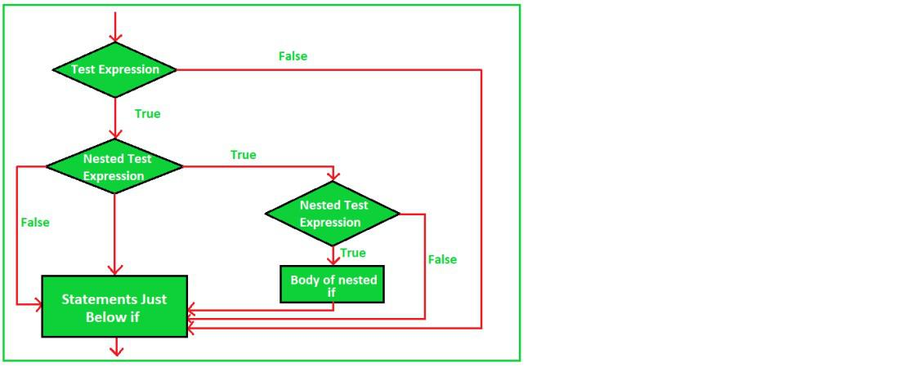
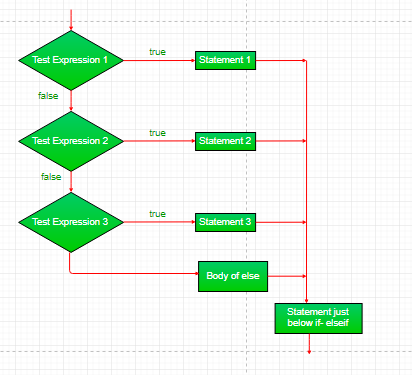
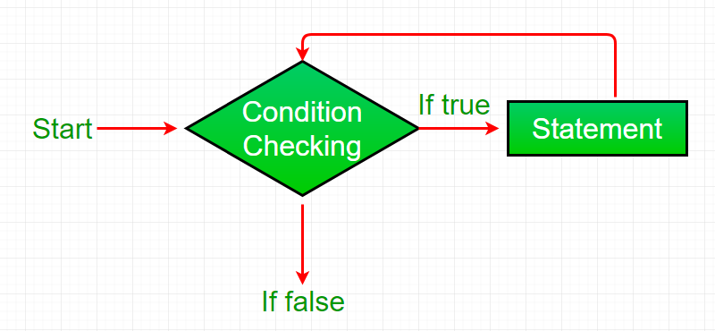
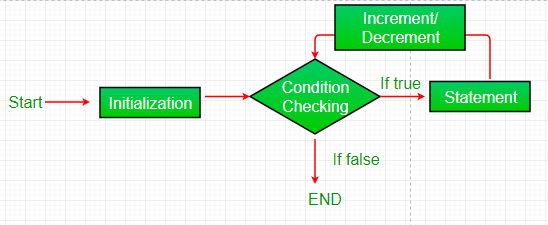
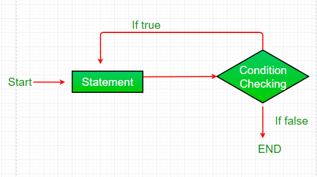

# JavaScript Comparison Operators

Operators are used to perform specific mathematical and logical computations on operands. Like C, C++, Java, Python and various other languages, JavaScript also supports Comparison operations. Comparison operators are used in logical statements to determine equality or difference between variables or values. There are various comparison operators supported by JavaScript:

- Equality Operators
- Relational Operators


### Equality Operators

1. Equality (==): 
This operator is used to compare the equality of two operands. If equal then the condition is true otherwise false.

Syntax:

x == y
Below examples illustrate the (==) operator in JavaScript:

Example 1:

```js
// Illustration of (==) operator
let val1 = 5;
let val2 = '5';

// Checking of operands
console.log(val1 == 5);
console.log(val2 == 5);        
console.log(val1 == val1);

// Check against null and boolean value
console.log(0 == false);   
console.log(0 == null);
```

Output:

```
true
true
true
true
false
```

Example 2:

```js
// Illustration of (==) operator
let obj1 = {'val1': 'value'};
let obj2 = {'val2': 'value'};

// Checking of operands
console.log(obj1.val1 == 'value');        
console.log(obj1 == obj2);
console.log(obj1.val1 == obj2.val2);

// Check against undefined
console.log(0 == undefined);   
console.log(null == undefined);
```

Output:
```
true
false
true
false
true
```

2. Inequality (!=): 
This operator is used to compare the inequality of two operands. If equal then the condition is false otherwise true.

Syntax:

```
x != y
```


Below examples illustrate the (!=) operator in JavaScript:

Example 1:

```js
// Illustration of (!=) operator
let val1 = 5;
let val2 = '5';

// Checking of operands
console.log(val1 != 6);
console.log(val2 != '5');        
console.log(val1 != val1);

// Check against null and boolean value
console.log(0 != false);   
console.log(0 != null);
```

Output:
```
true
false
false
false
true
```

Example 2:

```js
// Illustration of (!=) operator
let obj1 = {'val1': 'value'};
let obj2 = {'val2': 'value'};

// Checking of operands
console.log(obj1.val1 != 'value');        
console.log(obj1 != obj2);
console.log(obj1.val1 != obj2.val2);

// Check against undefined
console.log(0 != undefined);   
console.log(null != undefined);
```

Output:
```
false
true
false
true
false
```

3. Strict equality (===): 
This operator is used to compare the equality of two operands with type. If both value and type are equal then the condition is true otherwise false.

Syntax:
```
x === y
```

Below examples illustrate the (===) operator in JavaScript:

Example 1:

```js
// Illustration of (===) operator
let val1 = 5;
let val2 = '5';

// Checking of operands
console.log(val1 === 6);
console.log(val2 === '5');        
console.log(val1 === val1);

// Check against null and boolean value
console.log(0 === false);   
console.log(0 === null);
```

Output:
```
false
true
true
false
false
```

Example 2:

```js
// Illustration of (===) operator
let obj1 = {'val1': 'value'};
let obj2 = {'val2': 'value'};

// Checking of operands
console.log(obj1.val1 === 'value');        
console.log(obj1 === obj2);
console.log(obj1.val1 === obj2.val2);

// Check against undefined
console.log(0 === undefined);   
console.log(null === undefined);
```

Output:

```
true
false
true
false
false
```

4. Strict inequality (!==): 
This operator is used to compare the inequality of two operands with type. If both value and type are not equal then the condition is true otherwise false.

Syntax:
```
x !== y
```

Below examples illustrate the (!==) operator in JavaScript:

Example 1:

```js
// Illustration of (!==) operator
let val1 = 5;
let val2 = '5';

// Checking of operands
console.log(val1 !== 6);
console.log(val2 !== '5');        
console.log(val1 !== val1);

// Check against null and boolean value
console.log(0 !== false);   
console.log(0 !== null);
```

Output:
```
true
false
false
true
true
```

Example 2:

```js
// Illustration of (!==) operator
let obj1 = {'val1': 'value'};
let obj2 = {'val2': 'value'};

// Checking of operands
console.log(obj1.val1 !== 'value');        
console.log(obj1 !== obj2);
console.log(obj1.val1 !== obj2.val2);

// Check against undefined
console.log(0 !== undefined);   
console.log(null !== undefined);
```

Output:
```
false
true
false
true
true
```

### Relational Operators:

1. Greater than operator (>): 
This operator is used to check whether the left side value is greater than the right side value. If value is greater then the condition is true otherwise false.

Syntax:

x > y
Below examples illustrate the (>) operator in JavaScript:

Example 1:

```js
// Illustration of (>) operator
let val1 = 5;
let val2 = "5";

// Checking of operands
console.log(val1 > 0);
console.log(val2 > "10");        
console.log(val1 > "10");
console.log(val2 > 0);
```

Output:
```
true
true
false
true
```

Example 2:

```js
// Illustration of (>) operator
let obj1 = {'val1': 1};
let obj2 = {'val2': 3};

// Checking of operands
console.log(obj1.val1 > 0);        
console.log(obj1 > obj2);
console.log(obj1.val1 > obj2.val2);
console.log(obj2 > obj1);
console.log(obj2.val2 > obj1.val1);
```

Output:
```
true
false
false
false
true
```

2. Greater than or equal operator (>=): 
This operator is used to check whether the left side operand is greater than or equal to the right side operand. If value is greater than or equal, then the condition is true otherwise false.

Syntax:
```
x >= y
```

Below examples illustrate the (>=) operator in JavaScript:

Example 1:

```js
// Illustration of (>=) operator
let val1 = 5;
let val2 = "5";

// Checking of operands
console.log(val1 >= 5);
console.log(val2 >= "15");        
console.log(val1 >= "5");
console.log(val2 >= 15);
```

Output:
```
true
true
true
false
```

Example 2:

```js
// Illustration of (>=) operator
let obj1 = {'val1': 1};
let obj2 = {'val2': 3};

// Checking of operands
console.log(obj1.val1 >= 0);        
console.log(obj1 >= obj2);
console.log(obj1.val1 >= obj2.val2);
console.log(obj2 >= obj1);
console.log(obj2.val2 >= obj1.val1);
```

Output:
```
true
true
false
true
true
```

3. Less than operator  (<): 
This operator is used to check whether the left side value is less than right side value. If yes then the condition is true otherwise false.

Syntax:
```
x < y
```

Below examples illustrate the (<) operator in JavaScript:

Example 1:

```js
// Illustration of (<) operator
let val1 = 5;
let val2 = "5";

// Checking of operands
console.log(val1 < 15);
console.log(val2 < "0");        
console.log(val1 < "0");
console.log(val2 < 15);
```

Output:
```
true
false
false
true
```

Example 2:

```js
// Illustration of (<) operator
let obj1 = {'val1': 1};
let obj2 = {'val2': 3};

// Checking of operands
console.log(obj1.val1 < 10);        
console.log(obj1 < obj2);
console.log(obj1.val1 < obj2.val2);
console.log(obj2 < obj1);
console.log(obj2.val2 < obj1.val1);
```

Output:
```
true
false
true
false
false
```

4. Less than or equal operator  (<=): 
This operator is used to check whether the left side operand value is less than or equal to the right side operand value. If yes then the condition is true otherwise false.

Syntax:
```
x <= y
```

Below examples illustrate the (<=) operator in JavaScript:

Example 1:

```js
// Illustration of (<=) operator
let val1 = 5;
let val2 = "5";

// Checking of operands
console.log(val1 <= 15);
console.log(val2 <= "0");        
console.log(val1 <= "0");
console.log(val2 <= 15);
```

Output:
```
true
false
false
true
```

Example 2:

```js
// Illustration of (<=) operator
let obj1 = {'val1': 1};
let obj2 = {'val2': 3};

// Checking of operands
console.log(obj1.val1 <= 10);        
console.log(obj1 <= obj2);
console.log(obj1.val1 <= obj2.val2);
console.log(obj2 <= obj1);
console.log(obj2.val2 <= obj1.val1);
```

Output:
```
true
true
true
true
false
```

**Supported Browsers:** The browsers supported by all JavaScript Comparison operators are listed below:

- Google Chrome
- Firefox
- Opera
- Safari
- Edge
- Internet Explorer


===============================================================================


# JavaScript Conditional Statements

The if-else or conditional statement will perform some action for a specific condition. If the condition meets then a particular block of action will be executed otherwise it will execute another block of action that satisfies that particular condition. Such control statements are used to cause the flow of execution to advance and branch based on changes to the state of a program.

Example: This example describes the if-statement in JavaScript.

```js
// JavaScript program to illustrate If statement
var i = 10;

if (i > 15) document.write("10 is less than 15");

// This statement will be executed
// as if considers one statement by default
console.log("I am Not in if");
```

Output:
```
I am Not in if
```

### JavaScript's conditional statements:

- if
- if-else
- nested-if
- if-else-if ladder

We will understand each conditional statement, its syntax, flowchart, and examples. Please refer to the Switch Case in JavaScript article to understand the switch case. Let's begin with the if-statement.

1. if-statement: It is a conditional statement used to decide whether a certain statement or block of statements will be executed or not i.e if a certain condition is true then a block of statement is executed otherwise not.

Syntax:

```
if(condition) 
{
   // Statements to execute if
   // condition is true
}
``` 

**The if statement accepts boolean values** - if the value is true then it will execute the block of statements under it. If we do not provide the curly braces '{' and '}' after if( condition ) then by default if statement considers the immediate one statement to be inside its block. For example:

```
if(condition)
   statement1;
   statement2;

// Here if the condition is true, if block 
// will consider only statement1 to be inside 
// its block.
```

Flow chart:



3. if-else statement: The if statement alone tells us that if a condition is true it will execute a block of statements and if the condition is false it won't. But what if we want to do something else if the condition is false? Here comes the else statement. We can use the else statement with the if statement to execute a block of code when the condition is false.

Syntax:
```
if (condition)
{
    // Executes this block if
    // condition is true
}
else
{
    // Executes this block if
    // condition is false
}
```

Flow chart:


Example: This example describes the if-else statement in Javascript.

```js
// JavaScript program to illustrate If-else statement
var i = 10;

if (i < 15)
console.log("i is less than 15");
else
console.log("I am Not in if");
```


Output:
```
i is less than 15
```

4. nested-if statement: JavaScript allows us to nest if statements within if statements. i.e, we can place an if statement inside another if statement. A nested if is an if statement that is the target of another if or else. 

Syntax:
```
if (condition1) 
{
   // Executes when condition1 is true
   if (condition2) 
   {
      // Executes when condition2 is true
   }
}
```

Flow chart:


 
Example: This example describes the nested-if statement in JavaScript.

```js
// JavaScript program to illustrate nested-if statement
var i = 10;

if (i == 10) {

// First if statement
if (i < 15)
console.log("i is smaller than 15");

// Nested - if statement
// Will only be executed if statement above
// it is true
if (i < 12)
console.log("i is smaller than 12 too");
else
console.log("i is greater than 15");
}
```

Output:
```
i is smaller than 15
i is smaller than 12 too
```

5. if-else-if ladder statement: Here, a user can decide among multiple options. The if statements are executed from the top down. As soon as one of the conditions controlling the if is true, the statement associated with that if is executed, and the rest of the ladder is bypassed. If none of the conditions is true, then the final else statement will be executed.

Syntax:

```
if (condition)
    statement;
else if (condition)
    statement;
.
.
else
    statement;
```

**Flow chart:**




Example: This example describes the if-else-if ladder statement in JavaScript.

```js
// JavaScript program to illustrate nested-if statement
var i = 20;

if (i == 10)
console.log("i is 10");
else if (i == 15)
console.log("i is 15");
else if (i == 20)
console.log("i is 20");
else
console.log("i is not present");
```

Output:

```
i is 20
```

Supported Browsers:

- Google Chrome 1.0
- Firefox 1.0
- Microsoft Edge 12.0
- Internet Explorer 3.0
- Opera 3.0
- Safari 1.0


================================================================================


# JavaScript Ternary Operator

"Question mark" or "conditional" operator in JavaScript is a ternary operator that has three operands.

The expression consists of three operands: the condition, value if true and value if false.
The evaluation of the condition should result in either true/false or a boolean value.
The true value lies between "?" & ":" and is executed if the condition returns true. Similarly, the false value lies after ":" and is executed if the condition returns false.

Syntax:
```
condition ? value if true : value if false
Expression to be evaluated which returns a boolean value.
Value to be executed if condition results in true state.
Value to be executed if condition results in false state.
```

Examples:
```
Input: let result = (10 > 0) ? true : false;
Output: true

Input: let message = (20 > 15) ? "Yes" : "No";
Output: Yes
```

The following programs will illustrate conditional operator more extensively: Program 1: 

```js
function gfg() {  
//JavaScript to illustrate 
//Conditional operator 

let age = 60 
let result = (age > 59)? 
"Senior Citizen":"Not a Senior Citizen"; 

console.log(result); 
}  
gfg();  
```

Output: Senior Citizen
 

An example of multiple conditional operators. Program 2: 


```
function gfg() {  
//JavaScript to illustrate
//multiple Conditional operators

let marks = 95;
let result = (marks < 40) ? "Unsatisfactory": 
            (marks < 60) ? "Average":
            (marks < 80) ? "Good":"Excellent";

console.log(result);
}  
gfg();
``` 

Output: Excellent

================================================================================

# JavaScript Logical Operators

There are three logical operators in JavaScript: 

- !(NOT)
- &&(AND)
- ||(OR)

1. !(NOT) 
It reverses the boolean result of the operand (or condition). 

result = !value;

The following operator accepts only one argument and does the following:  

- Converts the operand to boolean type i.e true/false
- Returns the flipped value

Example: 

```js
// !(NOT) operator
let geek = 1;
console.log(!geek);
```

Output: false

The operator converted the value '1' to boolean and it resulted in 'true' then after it flipped(inversed) that value and that's why when we finally alert the value we get 'false'.  

2. &&(AND) 

The && operator accepts multiple arguments and it mainly does the following:  

- Evaluates the operands from left to right
- For each operand, it will first convert it to a boolean. If the result is false, stops and returns the original value of that operand.
- otherwise if all were truthy it will return the last truthy value.

result = a && b; // can have multiple arguments.

Example:

```js
// &&(AND) operator
console.log( 0 && 1 ); // 0
console.log( 1 && 3 ); // 3
console.log( null && true ); // null
console.log( 1 && 2 && 3 && 4); // 4
```

Output:
```
0
3
null
4
```


3. ||(OR) 
The 'OR' operator is somewhat opposite of 'AND' operator. It does the following:  

- evaluates the operand from left to right.
- For each operand, it will first convert it to a boolean. If the result is true, stops and returns the original value of that operand.
- otherwise if all the values are falsy, it will return the last value.

result = a || b;

Example:  

```js
// ||(OR) Operator
console.log( 0 || 1 ); // 1
console.log( 1 || 3 ); // 1
console.log( null || true ); // true
console.log( -1 || -2 || -3 || -4); // -1
```

Output:
```
1
1
true
-1
```

Supported Browser:

- Google Chrome
- Microsoft Edge
- Firefox
- Opera
- Safari


================================================================================

# JavaScript Nullish Coalescing

Nullish Coalescing Operator: It is a new feature introduced in this ECMA proposal has now been adopted into the official JavaScript Specification. This operator returns the right hand value if the left hand value is null or undefined. If not null or undefined then it will return left hand value. Before, setting default values for undefined and null variables required the use of if statement or the Logical OR operator "||" as shown below:

Program: 
```js
function foo(bar) {
    bar = bar || 42;
    console.log(bar);
}

foo();
```
Output:
```
42
```

When the passed parameter is less than the number of parameters defined in the function prototype, it is assigned the value of undefined. To set default values for the parameters not passed during the function call, or to set default values for fields not present in a JSON object, the above method is popular.

Program: 
```js
function foo(bar) {
    bar = bar || 42;
    console.log(bar);
}

foo(0);
```
Output:
```
42
```

There are values in JavaScript like 0 and an empty string that are logically false by nature. These values may change the expected behavior of the programs written in JavaScript. All the reoccurring problems led to the development of the Nullish Coalescing Operator. The Nullish Coalescing Operator is defined by two adjacent question marks ?? and its use is as follows:

Syntax:
```
variable ?? default_value
```

Examples: If the passed variable is either null or undefined and only if it is those two values, the default value would be returned. In all other cases including 0, empty string, or false, the value of the variable is returned and not the default value.

Program 1: 
```
function foo(bar) {
    bar = bar ?? 42;
    console.log(bar);
}

foo();  // 42
foo(0); // 0
```
Output:
```
42
0
```

Program 2: The more common use case is to set default values for JSON objects as follows. 

```js
const foo = {
    bar: 0
}

const valueBar = foo.bar ?? 42;
const valueBaz = foo.baz ?? 42;

// Value of bar: 0
console.log("Value of bar: ", valueBar);

// Value of bar: 42
console.log("Value of baz: ", valueBaz);
```

Output:
```
Value of bar:  0
Value of baz:  42
```

Supported Browsers: The browsers supported by JavaScript Nullish Coalescing Operator are listed below:

- Google Chrome 80
- Firefox 72


================================================================================

# JavaScript Loops

Looping in programming languages is a feature which facilitates the execution of a set of instructions/functions repeatedly while some condition evaluates to true. For example, suppose we want to print “Hello World” 5 times. This can be done in two ways: 

Without Loops we would have to write 'console.log("Hello World")' 5 times. But imagine we had to print "Hello World" 100-200 times. It is not feasible to write 200 lines of code to print "Hello World". This is where loops come into picture.
With Loops the statement needs to be written only once and the loop will be executed it as many times as required.

Example: Printing "Hello World" 10 times.

```js
var i;
for (i = 0; i < 10; i++)
{
    console.log("Hello World!");
}
```

Output:
```
Hello World!
Hello World!
Hello World!
Hello World!
Hello World!
Hello World!
Hello World!
Hello World!
Hello World!
Hello World!
```

You can observe that in the above program using loops we have used the console.log statement only once but still, the output of the program will be the same as that of the iterative program where we have used the console.log statement 10 times. In computer programming, a loop is a sequence of instructions that is repeated until a certain condition is reached.

- An operation is done, such as getting an item of data and changing it, and then some condition is checked such as whether a counter has reached a prescribed number.
- **Counter not Reached:** If the counter has not reached the desired number, the next instruction in the sequence returns to the first instruction in the sequence and repeats it.
- **Counter reached:** If the condition has been reached, the next instruction “falls through” to the next sequential instruction or branches outside the loop.

There are mainly two types of loops:

- **Entry Controlled loops:** In these types of loops, the test condition is tested before entering the loop body. For Loops and While Loops are entry-controlled loops.
- **Exit Controlled loops:** In these types of loops the test condition is tested or evaluated at the end of the loop body. Therefore, the loop body will execute at least once, irrespective of whether the test condition is true or false. The do-while loop is exit controlled loop.

JavaScript mainly provides three ways for executing the loops. While all the ways provide similar basic functionality, they differ in their syntax and condition checking time. Let us learn about each one of these in detail.

 
1. While Loop
A while loop is a control flow statement that allows code to be executed repeatedly based on a given Boolean condition. The while loop can be thought of as a repeating if statement. 

Syntax :
```
while (boolean condition)
{
   loop statements...
}
```
**Flowchart:**



- While loop starts with checking the condition. If it is evaluated to be true, then the loop body statements are executed otherwise first statement following the loop is executed. For this reason, it is also called the Entry control loop
- Once the condition is evaluated to be true, the statements in the loop body are executed. Normally the statements contain an update value for the variable being processed for the next iteration.
- When the condition becomes false, the loop terminates which marks the end of its life cycle.
 

Example:
```
var i=1;
while(i <= 10)
{
    console.log("Hello World!");
    i++;
}
```

Output:
```
Hello World!
Hello World!
Hello World!
Hello World!
Hello World!
Hello World!
Hello World!
Hello World!
Hello World!
Hello World!
```

2. For Loop
For loop provides a concise way of writing the loop structure. Unlike a while loop, a for statement consumes the initialization, condition, and increment/decrement in one line thereby providing a shorter, easy-to-debug structure of looping.

Syntax:
```
for (initialization condition; testing condition; increment/decrement)
{
    statement(s)
}
```
Flowchart:




- **Initialization condition**: Here, we initialize the variable in use. It marks the start of a for loop. An already declared variable can be used or a variable can be declared, local to loop only.
- **Testing Condition:** It is used for testing the exit condition for a loop. It must return a boolean value. It is also an Entry Control Loop as the condition is checked prior to the execution of the loop statements.
- **Statement execution:** Once the condition is evaluated to be true, the statements in the loop body are executed.
- **Increment/ Decrement**: It is used for updating the variable for the next iteration.
- **Loop termination:** When the condition becomes false, the loop terminates marking the end of its life cycle.

Example:
```js
var i;
for (i = 0; i < 10; i++)
{
    console.log("Hello World!");
}
```

Output:
```
Hello World!
Hello World!
Hello World!
Hello World!
Hello World!
Hello World!
Hello World!
Hello World!
Hello World!
Hello World!
```

3. Do-While Loop

Do-While loop is similar to the while loop with the only difference that it checks for the condition after executing the statements, and therefore is an example of an Exit Control Loop.

Syntax:
```js
do
{
    statements..
}
while (condition);
```




- The do-while loop starts with the execution of the statement(s). There is no checking of any condition for the first time.
- After the execution of the statements, and update of the variable value, the condition is checked for a true or false value. If it is evaluated to be true, the next iteration of the loop starts.
- When the condition becomes false, the loop terminates which marks the end of its life cycle.
- It is important to note that the do-while loop will execute its statements at least once before any condition is checked, and therefore is an example of the exit control loop.
