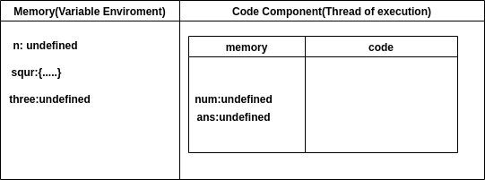
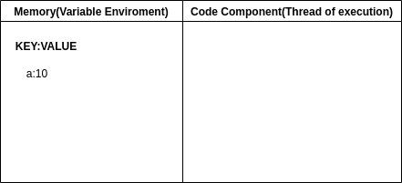
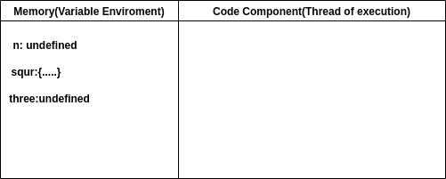
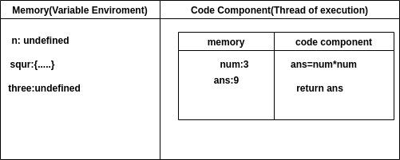
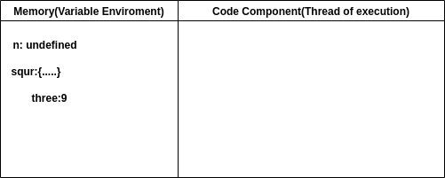

# Execution Context in Javascript

In every modern browser, we have a JS engine that is responsible for running javascript files. So whenever the browser encounters any JS file JS runtime engine comes into play .js runtime engine creates an environment where the actual code execution takes place and that environment is known as the Execution context.

In other words, the execution context is an environment inside the JS engine where memory execution and code execution takes place.

There are two types of execution context in JS:

- Global Execution context (GEC)
- Functional Execution Context (FEC)

A single global execution context is created for a single JS file. When a browser runs the code it runs a single JS file even if you are using any frontend libraries like react angular etc that contain multiple JS files. Webpack bundles all the different files into a single JS file and parses it. So it is important to remember that only one global execution context is created for a JS file. Although for different function invocations, multiple functional executions context gets created.

It is important to remember that each Execution Context has 3 components in it - 

- Variable Object/Arguments Object
- Environment for Scope and Scope chain
- Setting the value of this Keyword

### Execution Context is Created in 2 phases 

- Creation phase
- Execution phase

In the creation phase JS engine skims through the code and extracts variable declarations and function declarations and assigns variable declarations with undefined and function declarations with complete function code in the form of key-value pair. Only variables declared with the var keyword are extracted not let and const. Let's have a look at the pictorial representation of the Global execution context and functional execution context. In the creation phase variable environment is created and it will store everything in the form of key-value pair.

In the execution phase thread of execution is created where the code gets executed line by line in a synchronous manner as JavaScript is a single-thread synchronous language.

Representation Of Global Execution Context

 

Representation of Functional Execution Context



===============================================================================================================

# How JS executes code

Everything in JavaScript happens insides an EXECUTION CONTEXT, which you can assume to be a big box or a container in which whole JavaScript code is executed. The EXECUTION CONTEXT contains two parts one is Memory(Variable Environment), where all the variables and functions store key: value pair and the other is Code Component(Thread of Execution), where code is executed one line at a time(pictorial representation shown in below).

PICTORIAL REPRESENTATION OF EXECUTION CONTEXT

 

Now, What happens when you run JavaScript Code?

The simple answer is: A Execution Context Created.


Now we write a demo code below and we will say line by line, how the code run.  

```js
var n = 3;
function squr(num) {
    var ans = num * num;
    return ans;
}
var three = squr(n);
```

When you run this whole code a global EXECUTION CONTEXT is created and it contains two parts one is memory and the other is code execution.

When the first line is encountered it will reserve memory for all variables(n, three, five) and function(square). When reserving the memory for variables it reserves a special value undefined and for function, it stores whole code. the pictorial representation is shown below.


PICTORIAL REPRESENTATION OF GLOBAL EXECUTION CONTEXT


 

After allocating memory for all variables and function, code execution phase starts(code runs line by line).

Line 1: var n=3,  3 value placed into the n identifier.

Line 2-5: nothing to execute.

Line:6: we invoke a function, now function is the heart of JavaScript. The function is a mini-program and whenever a new function is invoked all together a new EXECUTION CONTEXT is created(inside the code execution phase). It also contains two-part memory and code execution phase. Memory is allocated for variable and function(it involves function parameters and other variables).


PICTORIAL REPRESENTATION OF FUNCTION EXECUTION CONTEXT
 
 

After allocating memory, the code execution phase comes here the code inside the function executes, and undefined is replaced by the actual value.


PICTORIAL REPRESENTATION  OF EXECUTION CONTEXT WHILE FUNCTION EXECUTE



 
After that, when 'return' is encountered, the control of the program is returned to the place where the function is invoked. The control goes to line 6, finding the answer in the local memory. The control then returns to line 3, and the value of 'three' (undefined) is replaced by the value of 'ans'. After that, the entire execution context is deleted.

PICTORIAL REPRESENTATION OF GLOBAL EXECUTION CONTEXT AFTER  CODE EXECUTED



After that Global Execution Context is Deleted and our program ends. And One more thing, JavaScript Handle everything deleted and created (to manage the execution context) it’s managing a stack. It's name CALL STACK. It’s a Stack that maintains the order of execution. 

===============================================================================================================

# CallStack

In order to manage Different Execution Contexts, we have something called as CallStack present in the javascript runtime. The job of the call stack is to manage and run execution contexts created while executing the code. Let's try to understand this with the help of an example.

```js
var x = 5 ; // Line 1
function getSum(num){
 var y=7 ;
 var total = num + y ;
 return total ;

}

var result1 = getSum(x); // Line 9
var result2 = getSum(9); // Line 10
```
 

Once the code execution starts, the Global execution context is created and it will sit on the top Callstack . Once the code execution reaches Line 9  new Function execution context is created for the getSum and now it will sit on the top of Callstack . Similarly, this function will get executed line by line, and once finished it will be popped out of the Callstack then execution for GEC will resume and once it gets finished it will also be popped out of the stack.

In order to see how does this call stack looks like Go to Devtools => Sources => CallStack
Put a debugger at line 1 and you will see anonymous inside CallStack Tab.

===============================================================================================================

# Hoisting

JS code is interpreted in two passes.

On the first pass, the interpreter
- Variables [not initializers] and function declarations.
- The second pass is the actual code execution step processed by an interpreter
- Variables that are not declared as function expressions.

Therefore, we can use the concept of "hoisting" to describe such behavior.

In Laymen's terms, Hoisting is a process whereby you can access the value of a variable or function even before it is initialized.

```js
console.log(age);
showName();

var age = 60 ;

function showName(){
 console.log("Prakash Sakari");
}
```

Output:
```
undefined
Prakash Sakari
```

Let us Understand the output 

We can see that the console.log(age) prints the output as undefined .This is due to hoisting.
During the creation phase of the Execution context, memory assigned to variable age is undefined. So when we try to access the age console prints undefined.


For the function named showName, we can see that we are able to invoke it before declaration as during the creation phase it was already available in the memory . Also if we try to console.log(showName) whole body of the function is printed. 
 

Now let us see how hoisting works in the case of a regular function expression 

```js
console.log(getname);

var getname = function shwname(){
 console.log(getname);
}
```
Output:
```
undefined
```

In the above code when we try to access variable getname , the value is undefined it is due to the fact that the memory is treating getname as a variable in the creation phase not as a function so we get undefined as an output.
You can also put a debugger and run the code in chrome dev tools and check in the scope section how variables and functions are assigned values during the creation phase and the execution phase.

===============================================================================================================

# Hoisting in let and const variable

In this article, we are going to understand how hoisting works in let and const variable declarations.
There is a lot of misconception about whether hoisting happens in let and const. Most people think since we cannot access let and const declared variables before initialization there is no hoisting phenomenon in let and const but that is not the case in JavaScript.

Let us Try to understand this with different examples.

Example-1:

```js
let x=10 ;
var y=11 ;
console.log(x); 
console.log(y); 
```

Output:
```
10
11
```

Output is 10 and 11 as expected.

Now let us Tweak it a little bit and see what happens when we try to access x and y before initializing them 

Example-2:

```
console.log(y);
console.log(x);
let x = 10;
var y = 11;
```

If You try to Run the above code it will show an error saying "ReferenceError: Cannot access 'x' before initialization".

Now Let us see what happens when we try to access a variable that is not even declared in a JS Programme

Example-3:

```js
console.log(a);
```

Upon running the above code You will see an error saying "ReferenceError: a is not defined"

Now here comes the answer to the initial question of whether hoisting occurs in let and const or not. If You look closely at example 2 the error says cannot access x before initialization but in example three the error is "a is not defined". Since we can clearly see the error in the example is about not accessing variable x before initialization it means that it must have existed somewhere in the memory before initialization but we are unable to access it. this special place in memory that we cannot access is known as the Temporal Dead zone.
So let and const are hoisted but they exist in Temporal Dead Zone.
So what is TDZ?

TDZ is the term to describe the state where variables are unreachable. They are in scope, but they aren't declared. The let and const variables exist in the TDZ from the start of their enclosing 
scope until they are declared.

In easier terms, it is a time period from where the variable is hoisted till the time when the variable is initialized with a value.

```js
//TDZ starts here 
console.log(y);
console.log(x);
let x = 9 ; //TDZ ends here 
console.log(x);
```
