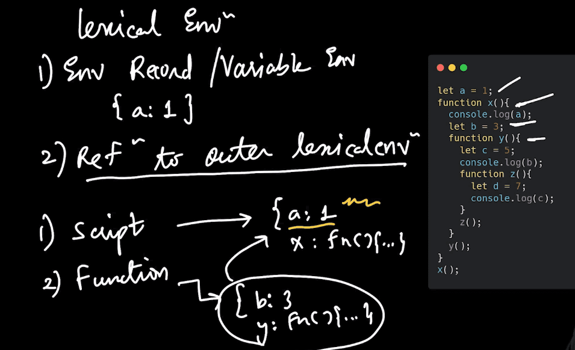
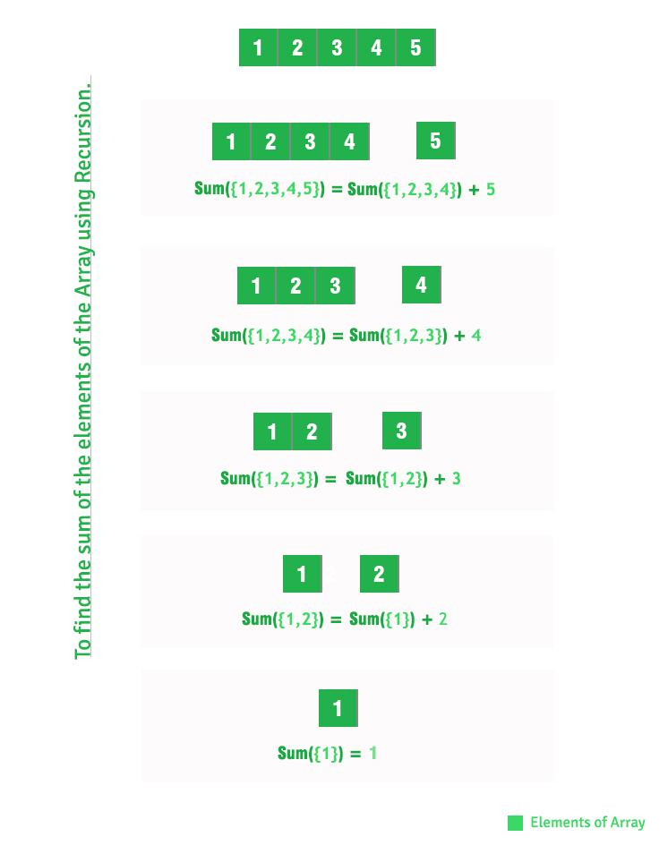
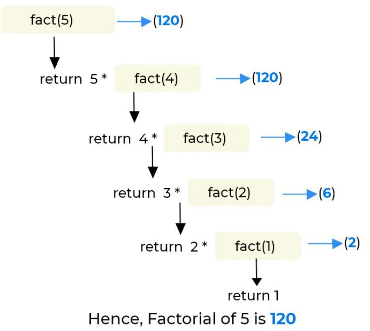

# Pure Functions

A Pure Function is a function (a block of code) that always returns the same result if the same arguments are passed. It does not depend on any state or data change during a program’s execution. Rather, it only depends on its input arguments.

Also a pure function does not produce any observable side effects such as network requests or data mutation etc.

Let's see the below JavaScript Function:

```js
function calculateGST( productPrice ) {
    return productPrice * 0.05;
}
```

The above function will always return the same result, if we pass the same productPrice. In other words, its output doesn't get affected by any other values / state changes. So we can call "calculateGST" function a Pure Function.

Now, let's see one more function below:

```js
var tax = 20;
function calculateGST( productPrice ) {
    return productPrice * (tax / 100) + productPrice;
}
```

*Pause a second and can you guess whether the above function is Pure or not ?*

If you guessed that it is isn't, you are right! It is not a pure function as the output is dependent on an external variable "tax". So if the tax value is updated somehow, then we will get a different output though we pass the same productPrice as a parameter to the function.

But here we need to make an important note:

**Note:** If a pure function calls a pure function, this isn’t a side effect and the calling function is still considered pure. (Example: using Math.max() inside a function)

Below are some side effects (but not limited to) which a function should not produce in order to be considered as a pure function -

- Making a HTTP request
- Mutating data
- Printing to a screen or console
- DOM Query/Manipulation
- Math.random()
- Getting the current time


-------------------------------------------------------------------------------------------

# First-Class Function

**First-Class Function:** A programming language is said to have First-class functions if functions in that language are treated like other variables. So the functions can be assigned to any other variable or passed as an argument or can be returned by another function. JavaScript treat function as a first-class-citizens. This means that functions are simply a value and are just another type of object.

Example: Let us take an example to understand more about the first-class function.

```js
const Arithmetics = {
add: (a, b) => {
return `${a} + ${b} = ${a + b}`;
},
subtract: (a, b) => {
return `${a} - ${b} = ${a - b}`
},
multiply: (a, b) => {
return `${a} * ${b} = ${a * b}`
},
division: (a, b) => {
if (b != 0) return `${a} / ${b} = ${a / b}`;
return `Cannot Divide by Zero!!!`;
}

}

console.log(Arithmetics.add(100, 100));
console.log(Arithmetics.subtract(100, 7));
console.log(Arithmetics.multiply(5, 5));
console.log(Arithmetics.division(100, 5));
```

Output:
```
100 + 100 = 200
100 - 7 = 93
5 * 5 = 25
100 / 5 = 20
```

Note: In the above example, functions are stored as a variable in an object.

 
Example 2:

```js
const Geek = (a, b) => {
return (a + " " + b);
}

console.log(Geek("Hello", "Geeks"));
```

Output:
```
Hello Geeks
```


---------------------------------------------------------------------------

# Higher-Order Function

A Higher-Order function is a function that receives a function as an argument or returns function as output. 

Example 1:

```js
function fxn1(){
	return "Hello";
}

//fxn2 recieves a function 'fxn1' as parameter
//Therefore, fxn2 this is a higher order function
function fxn2(fxn1){
	console.log(fxn1(),"Geeks");
}

fxn2(fxn1);
```

Output: Hello Geeks

In the above example we can see that fxn2 is accepting another function fxn1 as a parameter, so fxn2 is a higher order function.

 

Example 2:

```js
function fxn1(){
	return function (){
		console.log("Hello Geeks");
	}
}

//accepting the function returned from fxn1() and calling it.
const fxn2=fxn1();
fxn2();
```

Output:
```
Hello Geeks
```
In the above example we can see that fxn1() is returning a function, therefore we can say that fxn1 is a higher order function.


-------------------------------------------------------------------------

# map(), reduce() and filter() functions

The map(), reduce() and filter() are array functions that transform the array according to the applied function and return the updated array. They are used to write simple, short and clean codes for modifying an array instead of using the loops.

1. map() method: It applies a given function on all the elements of the array and returns the updated array. It is the simpler and shorter code instead of a loop. The map is similar to the following code: 

```js
arr = new Array(1, 2, 3, 6, 5, 4);
for(let i = 0; i < 6; i++) {
    arr[i] *= 3;
}
console.log(arr);
```

Output:
```
[ 3, 6, 9, 18, 15, 12 ]
```
 

Syntax:

```js
array.map(function_to_be_applied)
array.map(function (args) {
    // code;
})
```

Example: 
```js
function triple(n){
    return n*3;
}    
arr = new Array(1, 2, 3, 6, 5, 4);

var new_arr = arr.map(triple)
console.log(new_arr);
```

Output:
```
[ 3, 6, 9, 18, 15, 12 ]
```
 

2. reduce() method: It reduces all the elements of the array to a single value by repeatedly applying a function. It is an alternative of using a loop and updating the result for every scanned element. Reduce can be used in place of the following code: 

```js
arr = new Array(1, 2, 3, 6, 5, 4);
result = 1
for(let i = 0; i < 6; i++) {
    result = result * arr[i];
}
console.log(result);
```

Output:
```
720
```

Syntax: 
```js
array.reduce(function_to_be_applied)
array.reduce(function (args) {
    // code;
})
```

Example: 

```js
function product(a, b){
    return a * b;
}
arr = new Array(1, 2, 3, 6, 5, 4);

var product_of_arr = arr.reduce(product)
console.log(product_of_arr)
```

Output:
```
720
```

3. filter() method: It filters the elements of the array that return false for the applied condition and returns the array which contains elements that satisfy the applied condition. It is a simpler and shorter code instead of the below code using a loop: 

```js
arr = new Array(1, 2, 3, 6, 5, 4);
new_arr = []
for(let i = 0; i < 6; i++) {
    if(arr[i] % 2 == 0) {
         new_arr.push(arr[i]);           
    }
}
console.log(new_arr);
```

Output:
```
[ 2, 6, 4 ]
```
 

Syntax: 

```js
array.filter(function_to_be_applied)
array.filter(function (args) {
    // condition;
})
```

Example: 

```js
arr = new Array(1, 2, 3, 6, 5, 4);
var new_arr = arr.filter(function (x){
    return x % 2==0;
});

console.log(new_arr)
```

Output:
```
[ 2, 6, 4 ]
```


--------------------------------------------------------------------------------------------

# Argument Object

All the regular functions instead of Arrow functions have a special Object called Arguments Object that contains all the arguments passed to a function. It is an array Like Object present locally inside a function and it contains all the arguments passed to a function.

In javascript, if we pass more arguments than the specified parameters it won't give us an error. let's try to understand this with an example -
 

```js
function calculateTotal(a,b){
 return a + b;
}

const total = calculateTotal(3,4,5,6,7,8,9);
console.log(total);
```

Output:
```
7

As the output is 7 so it is true that it is not giving us an error but what is happening with the other arguments passed in a function call.
here is the argument object that comes into play. It stores all the arguments provided to it . Remember it is not a usual Object but an array-like Object. So we have a limit over the operations that we can perform over this arguments Object.
```

 

```js
function calculateTotal(a,b){
 console.log(arguments);
}

calculateTotal(3,4,5,6,7,8,9);
```

Output:
```
[Arguments] { '0': 3, '1': 4, '2': 5, '3': 6, '4': 7, '5': 8, '6': 9 }
so it looks like an array-like Object with key-value pairs.we can perform indexing over this objects.
if we want to change the value of a particular index we can do so as well
```
 

```js
function calculateTotal(a,b){
 arguments[0]= 9;
 console.log(arguments);
}

calculateTotal(3,4,5,6,7,8,9);
```

Output:
```
[Arguments] { '0': 9, '1': 4, '2': 5, '3': 6, '4': 7, '5': 8, '6': 9 }
```
 

You can see the value at index 0 is changed to 9.

We also have some caveats in this argument Object.
we can use the length method over this but we cannot use methods like map, filter, reduce that we use on normal Arrays.

So the solution to this problem is to convert the arguments object into an array so that we can use all the methods that are generally available for arrays.

```js
function calculateTotal(a,b){
 const arr1 = [...arguments];
 console.log(arr1);
 console.log(arguments);
}

calculateTotal(3,4,5,6,7,8,9);
```

Output
```
[
  3, 4, 5, 6,
  7, 8, 9
]
[Arguments] { '0': 3, '1': 4, '2': 5, '3': 6, '4': 7, '5': 8, '6': 9 }
```
 

Lets see what happens to the argument object when we have a Default parameter in our function :
 

```js
function hello(a = 10){
 console.log(a); // line2
 console.log(arguments); //line3
 arguments[0] = 9;   // line4
 console.log(arguments);   //line5
 console.log(a);  //line6
}

hello(4);
```

Output:
```
4
[Arguments] { '0': 4 }
[Arguments] { '0': 9 }
4
```
 

- In case of default Parameter

Here in line 2 when the value of a is 4 as this was the argument passed to the hello function when it was called so the default value of a is changed to 4 from 10. 
Now when argument object value at zero index was changed to 9 .Will it going to change the value of a as well? 
No. Changing the argument object won't change the value of 'a'. The value of 'a' will be the initial value that was passed through the first call of the hello(4) method.


--------------------------------------------------------------------------------------------


# Rest parameter

The rest parameter is very similar to arguments Objects but it has some subtle differences. Let us try to understand it with the help of an example.

```js
function calculateTotal(a,b,...rest){
console.log(a);
console.log(b);
console.log(rest);
}

calculateTotal(2,3,4,5,7,8,9,11.16);
```


Output:
```
2
3
[ 4, 5, 7, 8, 9, 11.16 ]
```

So basically rest parameter collects all the remaining arguments and forms an array containing all of them as the name suggests rest parameter.

The most important Point to remember about the rest parameter is that it should always be used as the last parameter of the function otherwise there will be a syntax error.

The rest parameter is valuable when you are unsure about the number of arguments a function will have. It collects all these arguments into an array, allowing you to perform various manipulations to achieve the desired results using that array.


---------------------------------------------------------------------------------------------------


# Variable Scope - Global, Local and Block Scope

Consider You are sitting in a room. How far can you see?


You can see only inside the room because that is where your vision can go and is limited to see inside those walls of the room.
Similarly, Scope in Programming is where can a variable be accessed in the environment where it is declared that is the visibility where the variable can be used.


We generally have three types of scope 
1) Global Scope
2) Local Scope 
3) Block Scope 
 


Example of Global Variable: 

```js
var x = 6 ; //Global Scope 

function hello(){
 
 console.log(x);

}

hello();
```

Output:
```
6
```

 

Variable x is written in the top-level code so it is global scope and javaScript has this concept that even inside a hello function x is not declared but it is still able to console the value of x from inside the function as the variable x is global Scope and this is how it works in Javascript.

Example Of Local Variable
 
```js
var x = 6 ; //Global Scope 

function hello(){
 var y = 17; // Local Scope
 console.log(x);
 console.log(y);
}

hello();
```

Output:
```
6
17
```

Inside Function hello(), variable y is local Scope as it can only be accessed within the function, if you try to access it outside the function it will show a syntax error that y is not declared.
Even if We use let and const variable declaration, Global and Local variable concepts will work the same way.

Let us Now Understand About the type of Scope 

- Global Scope - visibility all over the javascript Code 
- Block Scope  - visibility only inside a piece of code generally wrapped by curly braces 

A block in programming is generally a way to wrap multiple lines of code to define that they work in series and we use { } brackets to define a Block Scope Example - for loop functions and if Block.

let and const declared variables are Block Scope and variables declared with keyword var are either global scope or function Scoped.
Consider this  Example 
 

```js
{
 let a = 10 ;
 let b = 20 ;
}

console.log(a);
console.log(b);
```

If we try to compile this code it will throw us an error as a and b are let declarations so they are only block Scope .lets see what happens when we try the same code with var declared variable.
 

```js
{
 var a = 10 ;
 var b = 20 ;
}

console.log(a);
console.log(b);
```

Output:
```
10
20
If we try to do the same with var declared variable it will give us the output as 
10
20
because var is either Global scope or Local Scope.
```


What if we try to use a var declared variable inside a function ?

In that case, they will act as a local variable and can only be accessed from inside the function. Example

```js
function hello() {
 var a = 10 ;
 var b = 20 ;
}

console.log(a);
console.log(b);
```
 

This code will give us an error if we try to compile it because no matter if var declaration is used since a and b are declared inside the function they will act as a local variable containing the scope only within the function.

So to summarize variables declared with var have Global Scope and variables declared with let and const have block Scope.
When a variable is declared with var keyword inside an if block it has a global scope but when it is declared inside a function it becomes a local variable of that function and cannot be accessed outside that function.
Variable declared with let and const always have block Scope. 


=========================================================================================================


# Scope and Scope Chain

In JavaScript, the scope chain refers to the hierarchical order in which the runtime looks up variables and functions in the current execution context.

 

When a function is executed, a new execution context is created, which has its own variable environment. This environment includes all the variables and functions declared inside the function, as well as any variables declared in outer scopes that the function has access to.

The scope chain is created by linking together all the variable environments of the current execution context and its parent contexts, forming a chain. When the JavaScript engine looks up a variable or function, it first checks the current execution context's variable environment. If the variable or function is not found there, it then moves up the scope chain to the parent context's variable environment, and so on, until it either finds the variable or function or reaches the global object (i.e., the window object in a web browser).

This mechanism allows functions to access variables declared in their outer scopes, a feature is known as lexical scoping. It also helps prevent naming collisions by ensuring that variables with the same name declared in different scopes don't interfere with each other.
 

```js
let a = 10;
function x(){
  let b = 20 ;
  console.log({ a });
  function y(){
    let c = 30;
    console.log({ b });
    function z(){
     console.log({ c });
    }
    z();
  }
  y();  
}
x();
```

Output:
```
{ a: 10 }
{ b: 20 }
{ c: 30 }
```


Before Understanding the Output,it is important to remember that the function created inside a function can only be called within its parent Scope. That is function z can only be called from within the function y as function y acts as its parent Scope and where the function is physically created.


- Coming to the output part


When x() is invoked and we reach console.log(a), the js compiler first looks in the local scope of the function x that whether variable a is present there. Since it cannot find variable a within its own local scope, it moves up in the scope chain that is it will look in the global scope of the program whether variable a is present there or not. Since a is found in the global scope it will print the value of a.

Similarly when function y is invoked and we reach the line of console.log(b); it will first try to find the value of b, in the local Scope once the value is not found it will move up to its parent scope function that function x() since function x contains variable b .The value of b, will be printed. Similarly, for the case of function invocation of z(), if variable c is not present in the local scope of function z, it will move up in its parent scope and once it finds the variable c in its parent scope, it will print the value of variable c as well.

It is important to note that the js compiler will keep looking up the ints parent scope and follows the hierarchy up till the global scope(top-level code).In case it does not find the variable in the topmost global scope as well it will then throw an error.

- The example below will clear the concept in a better way:

```js
let a = 10;
let b = 20 ;
let c = 30;
function x(){
  console.log({ a });
  function y(){
    console.log({ b });
    function z(){
     console.log({ c });
    }
    z();
  }
  y();  
}
x();
```

Output:
```
{ a: 10 }
{ b: 20 }
{ c: 30 }
```

If we shift the declaration of variables a,b,c to the topmost scope,we still get the same result because the compiler will keep looking in the parent of the parent hierarchy until it found the variable in the top-most scope i.e Global Scope of the program.

**Let us try to Understand the Scope Chain with respect to Execution Context and Lexical Environment.**



So Scope chain is Possible Due to something called a lexical Environment .
A lexical environment in JavaScript refers to the set of variables, functions, and other data structures that are available in a particular section of code during its execution. It consists of two parts: a variable environment and a reference to the outer lexical environment

Whenever a function executes it has 2 things.

1) Variable Environment
2) Reference to Outer Lexical Environment that is the Parent's lexical Environment.

So if we analyze the above code 

when x() is invoked its variable environment will have a variable b and function y but it will also have an access to its outer lexical Environment which is the global lexical environment in this case so since function x does not have a variable a declared inside it, it is still able to access a which is present in its outer lexical Environment. This is because every function has access to its outer lexical Environment as well.

The above explanation is valid for the function invocation of y() as well since function y() only has variable c and function z() in its variable environment, it is still able to console.log(b) because it has an excess to its outer lexical environment which is function x() in case of function y().

The above explanation is valid for the function invocation of function z() , since function z() has only access to variable d in its variable environment it is still able to access variable c and print its value which is present or declared in function y, the same explanation holds true that it also has a reference to its parent environment as well which is function y().


----------------------------------------------------------------------------------------------

Recursion

Recursion is the way of writing a piece of code in an elegant manner by calling the same function from within that function.
the best way to understand the recursion is to use the dry run and pictorial representation of each step.
in this article we are going to understand recursion using two examples 

1) Sum of elements of an array using recursion
2) Factorial of a number using recursion
 

Sum of elements of an array using recursion

```js
// JavaScript program to find sum of array
// elements using recursion.
 
// Return sum of elements in A[0..N-1]
// using recursion.
function findSum(A, N) {
    if (N <= 0)
        return 0;
    return (findSum(A, N - 1) + A[N - 1]);
}
 
// Driver code
 
let A = [1, 2, 3, 4, 5];
let N = A.length;
const total = findSum(A,N);
console.log(total);
```

Output:
```
15
``` 

Have a look at the image representation of every step of the function call .

 


# Factorial of a number using recursion
 
```js
// Javascript to find factorial
// of given number  
// function to find factorial
// of given number
function factorial(n) {
  if (n == 0) return 1;
  return n * factorial(n - 1);
}
  
// Driver Code
let num = 5;
const fact = factorial(num);
console.log(fact);
```

Output:
```
120
```




=====================================================================================


# Closures

A closure is the combination of the function bundled together with reference to its lexical environments is known as closure.
In other words - A closure is a function that remembers its outer variable and can access them.

Look at the example below.
 
```js
function x(){
  let a = 10 ;
  function y(){
   let b = 20;
   console.log(a);
    function z(){
     console.log(b);
    }
   z();
  } 
 y();
}
x();
```

Output:
```
10
20
```

Here if you see function z() does not have variable b in its scope so it looks up in the hierarchy for the value of b and since it has reference to its outer lexical environment it is able to print the value of b .hence this function forms a closure with its outer environment and can access the variable of its outer environment as well.

Now the concept of closures is quite similar to that we learned in the Scope and Scope chain article but there is more to closures.
let's try to understand this example
 
```js
function x(){
  let a = 10 ;
  return function y(){
   console.log(a);
  } 
}
const z = x();
z();
```

Output:
```
10
```

Technically in the above example when the code execution for function x() is finished, it is cleared from memory i.e once the function has finished executing the functional execution context or the Global Execution Context is deleted from the memory so all the lexical environment variables are also gone. But we can see that if we return the function in a variable and call it using that variable the value of a is still printed in the correct way although the execution of function x() has already been finished and memory for function x() that was holding variable a in itself is also gone. So how does variable a is still accessible .this is where the second definition of closures comes into effect.


" A closure is a function that remembers its outer variable and can access them ."
function y closes over the function x(), the memory used for the execution of function x() is gone but the scope chain that function y() has is still intact .this is the reason that we are able to access variable a  through function z() even after the memory for function x() is gone.
There are certain caveats in closures as well.


Example-1 

```js
function x(){
 let a = 10;
 return function y(){
  console.log(a);
  let a;
 }
}
const z = x();
z();
```

If You try to run this code the output will not be 10 but it will give an error saying cannot access a before initialization.
The reason is that although function y() is forming the closure with function x() if we recall the concept of hoisting let and const declarations are hoisted but they exist in the temporal dead zone so they cannot be accessed before initialization and compiler first try to access the local variable of function y() if it does not exist then it goes to the parent scope. Similarly inside function y if we change the let declaration with var keyword then the output will be undefined, the reason being the same -:
 

```js
function x(){
 var a = 10;
 return function y(){
  console.log(a);
  var a;
 }
}
const z = x();
z();
```

Output:
```
undefined
```